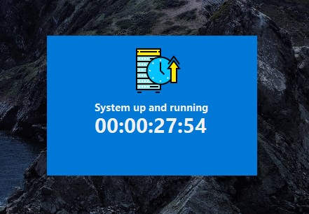
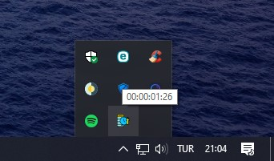
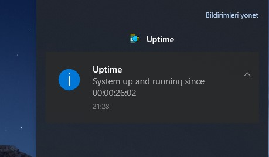

# windows-uptime
Uptime widget for Windows. - How long has it been since my computer started?
 
### Features
- [x] Show notification when start.
- [x] Minimized on tray
- [x] Show uptime when hover application icon.

### Interface

### Tray Icon Hover

### Notification

#### Improvements / TODO
- [ ] Start on startup
- [ ] Logging
- [ ] Analyze Logs
